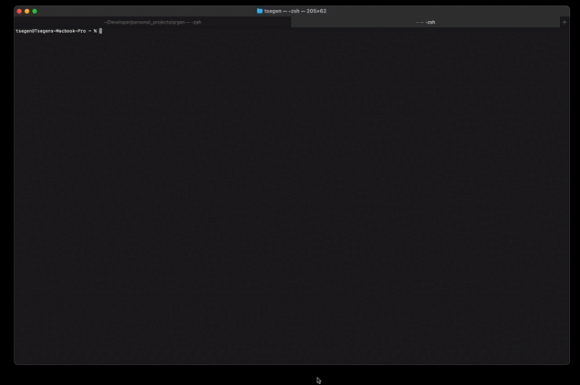

# Maqr (pronounced mack-er)
A cli tool to generate QR codes


# Usage

```shell
Usage: maqr [options] [data]

A cli tool to generate qr codes

Arguments:
  data                     data to be encoded in qrcode (default: null)

Options:
  -v                       --version
  -f, --format <format>    format of qr code (supported formats: png | svg | jpeg | base64 | base64:png | base64:jpeg | base64:webp) (default: "png")
  -o, --output <filename>  output qr code to file (supported file extensions: .png | .svg | .html | .jpeg | .jpg | .webp )
  -s, --small              whether or not to generate smaller sized qr code (only applies to qr code printed to the terminal) (default: false)
  -h, --help               display help for command
```


## Getting Started

1. Install globally from npm

```shell
npm install -g maqr
```

2. Help menu prompt

```shell
maqr --help
```

3. Generate a dummy QR code

```shell
maqr "Hello World"
```

# Demo


## ❤️ Found this project useful?
If you found this project useful or you like what you see, then please consider giving it a ⭐️ on Github and sharing it with your friends via social media.

## 🐛 Bugs/Request
Encounter any problem(s)? feel free to open an issue. If you feel you could make something better, please raise a ticket on Github and I'll look into it. Pull request are also welcome.

## ⭐️ License
[MIT LICENSE](./LICENSE)
